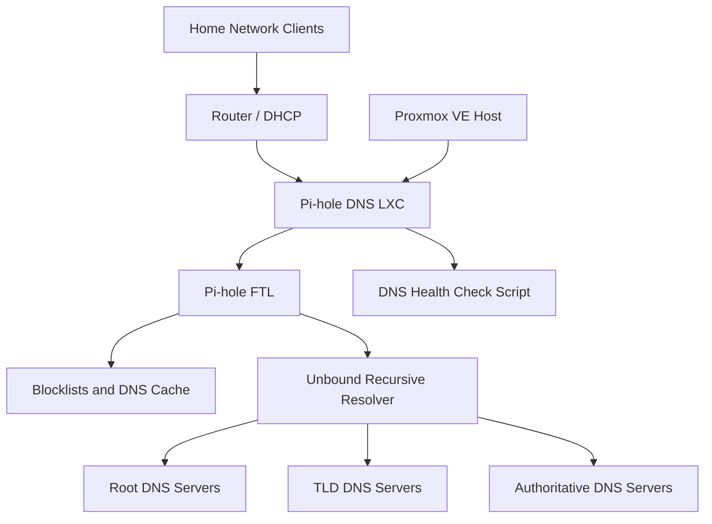
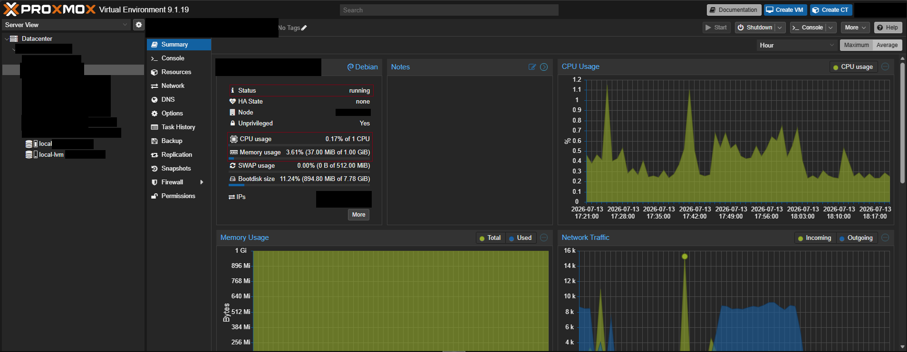
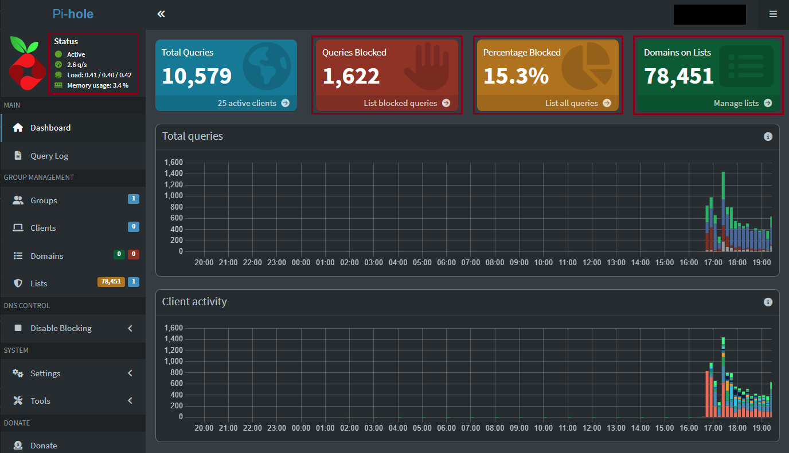
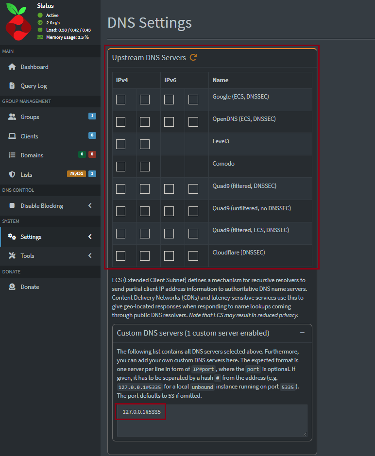
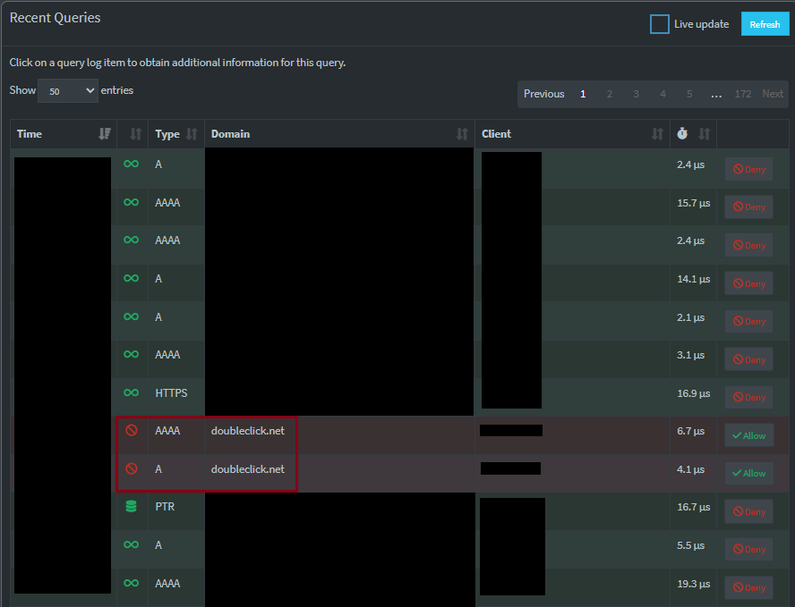
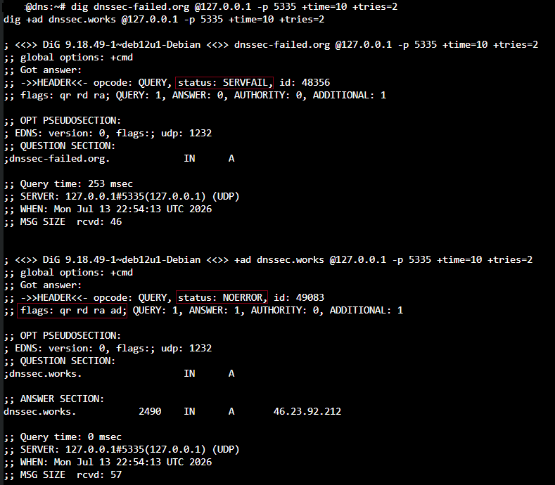
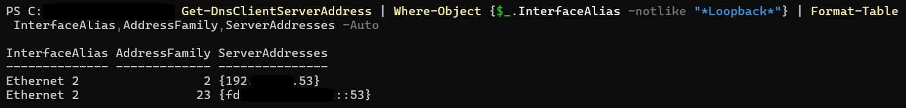
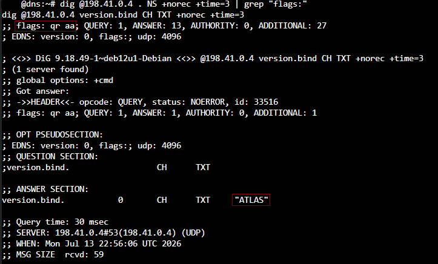
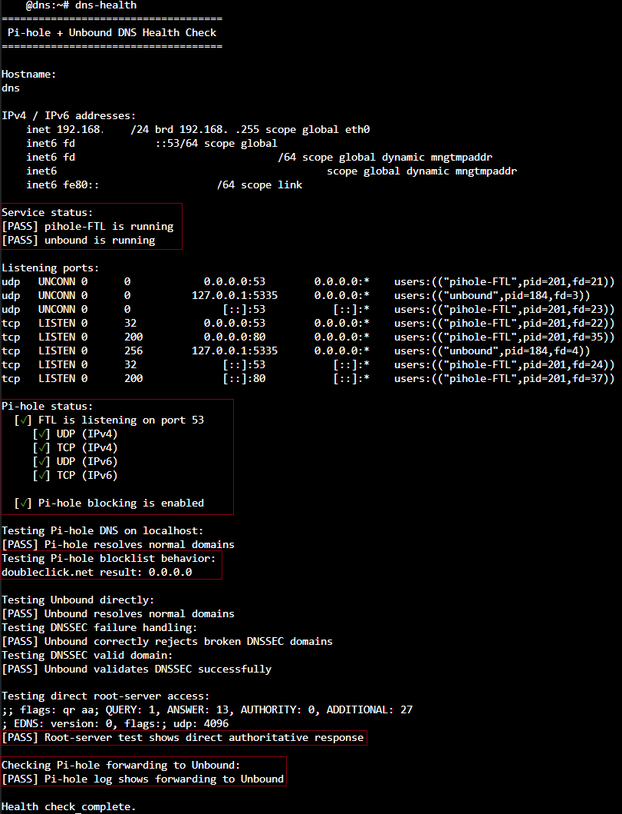

# Pi-hole + Unbound DNS Security Project

## Table of Contents

- [Project Summary](#project-summary)
- [Goals](#goals)
- [Evidence Included](#evidence-included)
- [Final Architecture](#final-architecture)
- [Core Components](#core-components)
- [DNS Resolution Flow](#dns-resolution-flow)
- [Pi-hole Configuration](#pi-hole-configuration)
- [Unbound Configuration](#unbound-configuration)
- [IPv4 and IPv6 DNS Design](#ipv4-and-ipv6-dns-design)
- [Troubleshooting: DNS Interception](#troubleshooting-dns-interception)
- [Health Check Script](#health-check-script)
- [Validation Results](#validation-results)
- [Security and Hardening Decisions](#security-and-hardening-decisions)
- [Problems Solved](#problems-solved)
- [Skills Demonstrated](#skills-demonstrated)
- [Future Improvements](#future-improvements)
- [Sanitization Notice](#sanitization-notice)

---

## Project Summary

This project documents the deployment of a local DNS security stack using **Pi-hole** and **Unbound** inside a lightweight, unprivileged Debian LXC container running on Proxmox VE.

The final setup provides network-wide DNS filtering, ad/tracker blocking, local DNS visibility, recursive DNS resolution, DNSSEC validation, IPv4 DNS support, IPv6 DNS support, and a custom health-check command for ongoing validation.

The project also includes troubleshooting of DNS interception caused by a router-level advanced security feature. That issue had to be identified and resolved before Unbound could function as a true recursive resolver.

---

## Goals

The main goals of this project were:

- Build a lightweight local DNS filtering server.
- Use Pi-hole for DNS sinkholing, visibility, and ad/tracker blocking.
- Use Unbound as a local recursive resolver instead of relying on a public upstream DNS provider.
- Confirm DNSSEC validation for trusted DNS responses.
- Support both IPv4 and IPv6 DNS clients.
- Avoid public exposure of the DNS service.
- Keep the DNS container unprivileged for safer isolation.
- Create a repeatable health-check command for ongoing operational validation.
- Document troubleshooting steps and validation evidence for portfolio use.

---

## Evidence Included

This case study includes sanitized screenshots showing the working deployment and validation results:

- Proxmox DNS LXC overview.
- Pi-hole dashboard overview.
- Pi-hole upstream DNS configuration pointing to Unbound.
- Pi-hole query log showing a blocked test domain.
- Windows client DNS settings using Pi-hole for IPv4 and IPv6.
- DNS health-check output with all checks passing.
- Root-server test showing direct authoritative DNS responses.
- Unbound DNSSEC tests showing broken DNSSEC rejection and valid DNSSEC authentication.

Sensitive values such as internal IPs, public IPv6 addresses, full IPv6 prefixes, usernames, client names, host-specific details, and unrelated query log entries have been redacted.

---

## Final Architecture



### Proxmox DNS LXC Overview



The DNS service runs in a small unprivileged LXC container. The container uses low CPU and memory while providing network-wide DNS filtering and recursive resolution.

---

## Core Components

| Component | Role |
|---|---|
| Proxmox VE | Hosts the DNS LXC container |
| Debian LXC | Lightweight Linux container for the DNS stack |
| Pi-hole | DNS filtering, blocklists, query logging, web dashboard |
| Unbound | Local recursive DNS resolver with DNSSEC validation |
| Router DHCP/DNS settings | Distributes Pi-hole as the DNS server to clients |
| Windows client | Used to validate IPv4 and IPv6 DNS assignment |
| Custom `dns-health` command | Validates DNS service health and configuration |

---

## DNS Resolution Flow

The final DNS flow is:

```text
Client device
  → Pi-hole on port 53
  → Pi-hole checks cache and blocklists
  → Allowed queries forward to Unbound on 127.0.0.1#5335
  → Unbound performs recursive DNS resolution
  → Unbound validates DNSSEC where supported
  → Response returns through Pi-hole to the client
```

This design keeps local DNS filtering and recursive DNS resolution on the same DNS server while avoiding public DNS upstream providers for normal allowed queries.

---

## Pi-hole Configuration

Pi-hole provides the filtering and visibility layer of the project.

Key configuration choices:

- Pi-hole listens for client DNS queries on port 53.
- Pi-hole blocking is enabled.
- Default blocklists are enabled.
- Query logging is enabled for local troubleshooting.
- The upstream DNS server is set to local Unbound.
- Public upstream DNS providers are unchecked after Unbound validation.

### Pi-hole Dashboard Overview



The dashboard shows Pi-hole actively handling DNS queries, blocking unwanted domains, and maintaining the enabled blocklist database.

### Pi-hole Upstream DNS Configuration



Pi-hole is configured to forward allowed queries to local Unbound using:

```text
127.0.0.1#5335
```

This confirms that Pi-hole is no longer using a public preset upstream resolver for normal allowed DNS queries.

### Blocked Query Evidence



The query log shows test queries for `doubleclick.net` being blocked. This validates that client traffic is reaching Pi-hole and that blocklist enforcement is working.

---

## Unbound Configuration

Unbound provides the recursive DNS layer of the project.

Key configuration choices:

- Unbound listens only on localhost.
- Unbound uses port `5335` so it does not conflict with Pi-hole on port 53.
- IPv4 recursive resolution is enabled.
- DNSSEC hardening is enabled.
- Root-server reachability is validated before relying on Unbound.
- Pi-hole forwards allowed queries to Unbound locally.

### DNSSEC Validation Evidence



The DNSSEC test validates both failure and success behavior:

- A known broken DNSSEC domain returns `SERVFAIL`.
- A valid DNSSEC domain returns `NOERROR` with the `ad` flag.

This confirms Unbound is rejecting invalid DNSSEC responses and authenticating valid DNSSEC responses.

---

## IPv4 and IPv6 DNS Design

The DNS server supports both IPv4 and IPv6 client DNS access.

Design choices:

- IPv4 clients receive the Pi-hole IPv4 DNS address from the router.
- IPv6 clients receive a stable local IPv6 DNS address for Pi-hole.
- The stable IPv6 DNS address is added automatically at boot using a small systemd service.
- Public or ISP-provided IPv6 DNS servers are not used as secondary DNS servers, preventing Pi-hole bypass.

### Windows Client DNS Validation



The Windows client confirms that both IPv4 and IPv6 DNS are pointing to the Pi-hole server.

---

## Troubleshooting: DNS Interception

Before Unbound was installed, direct root-server tests returned unexpected recursion-available responses.

Expected root-server behavior:

```text
flags: qr aa
```

Unexpected behavior observed during troubleshooting:

```text
flags included ra
```

The `ra` flag indicated that something was intercepting or proxying outbound DNS traffic. After testing from multiple systems, the issue was isolated to a router-level advanced security feature.

Resolution:

- Disabled the router advanced security DNS filtering feature.
- Retested direct root-server queries.
- Confirmed the response returned `aa` and no longer showed `ra`.
- Confirmed the `version.bind` root-server test returned `ATLAS`.
- Proceeded with Unbound installation only after direct root-server access was verified.

### Root-Server Test Evidence



The final root-server test shows an authoritative response and confirms DNS interception was no longer occurring.

---

## Health Check Script

A custom `dns-health` command was created for quick operational validation.

The script checks:

- Hostname.
- IPv4 and IPv6 addresses.
- Pi-hole service status.
- Unbound service status.
- Listening DNS and web ports.
- Pi-hole CLI status.
- Pi-hole normal DNS resolution.
- Pi-hole blocklist behavior.
- Unbound direct recursive resolution.
- DNSSEC failure handling.
- DNSSEC valid-domain authentication.
- Direct root-server access.
- Pi-hole forwarding to Unbound.

### DNS Health Check Evidence



The final health-check output shows all checks passing after Pi-hole, Unbound, IPv4 DNS, IPv6 DNS, DNSSEC validation, root-server access, and Pi-hole-to-Unbound forwarding were configured.

---

## Validation Results

| Test | Result |
|---|---|
| Pi-hole service running | Passed |
| Unbound service running | Passed |
| Pi-hole listening on port 53 | Passed |
| Unbound listening on `127.0.0.1#5335` | Passed |
| Pi-hole blocking enabled | Passed |
| Test ad/tracker domain sinkholed | Passed |
| Pi-hole forwards to Unbound | Passed |
| Unbound resolves normal domains | Passed |
| Broken DNSSEC domain returns `SERVFAIL` | Passed |
| Valid DNSSEC domain returns `ad` flag | Passed |
| Root-server response returns `aa` without `ra` | Passed |
| Windows receives IPv4 Pi-hole DNS | Passed |
| Windows receives IPv6 Pi-hole DNS | Passed |
| DNS container remains unprivileged | Passed |

---

## Security and Hardening Decisions

Security-focused decisions made during the project:

- Kept the DNS server inside an unprivileged LXC container.
- Avoided public exposure of the DNS service.
- Avoided public DNS fallback servers that would bypass Pi-hole.
- Removed router-level DNS interception before enabling recursive DNS.
- Used Unbound locally instead of forwarding normal allowed queries to a public preset resolver.
- Enabled DNSSEC validation through Unbound.
- Disabled Pi-hole internal NTP synchronization inside the unprivileged container instead of weakening container isolation with extra time-setting permissions.
- Used host-level time synchronization through Proxmox instead of granting the container additional clock-management privileges.

---

## Problems Solved

### Router DNS Interception

Problem:

- Root-server tests returned recursion-available responses instead of direct authoritative responses.

Solution:

- Identified a router advanced security feature as the likely interception source.
- Disabled the feature.
- Confirmed direct authoritative root-server responses before installing Unbound.

### IPv6 DNS Bypass Risk

Problem:

- Client devices received IPv4 Pi-hole DNS but still had ISP/router IPv6 DNS servers.

Solution:

- Added a stable local IPv6 address to the DNS container.
- Configured the router to distribute Pi-hole as the IPv6 DNS server.
- Confirmed Windows received both IPv4 and IPv6 Pi-hole DNS.

### LXC NTP Permission Warning

Problem:

- Pi-hole diagnosis reported an NTP client permission error because the unprivileged container could not adjust system time.

Solution:

- Kept the container unprivileged.
- Disabled Pi-hole internal NTP sync.
- Relied on Proxmox host-level time synchronization.

### Operational Validation

Problem:

- Manual DNS checks required multiple commands and were easy to forget.

Solution:

- Created a custom `dns-health` command to validate DNS health, DNSSEC, root-server access, blocking, and Pi-hole-to-Unbound forwarding.

---

## Skills Demonstrated

This project demonstrates practical experience with:

- Proxmox VE administration.
- Linux LXC container deployment.
- Debian server administration.
- Pi-hole DNS filtering.
- Unbound recursive DNS resolution.
- DNSSEC validation.
- IPv4 and IPv6 DNS client configuration.
- Router DNS and DHCP troubleshooting.
- DNS interception detection.
- Linux systemd service creation.
- Bash health-check scripting.
- Network troubleshooting with `dig`, `nslookup`, `ss`, and Pi-hole logs.
- Security-focused documentation and screenshot sanitization.

---

## Future Improvements

Possible future improvements:

- Add a second Pi-hole instance for DNS redundancy.
- Add automated monitoring or alerting for DNS service failures.
- Add log rotation or long-term metrics export.
- Add Grafana/Prometheus-style DNS dashboards.
- Add a documented restore procedure from Proxmox backups.
- Expand DNS logging into the existing SOC lab for detection practice.
- Add documented allowlist/blocklist tuning examples.

---

## Sanitization Notice

This public version has been intentionally sanitized for GitHub portfolio use.

Removed or generalized information includes:

- Internal IPv4 addresses.
- Public IPv6 addresses.
- Full local IPv6 prefixes.
- Client names and device names.
- Usernames.
- Host-specific identifiers.
- Browser/session details.
- Sensitive query log entries.
- Router-specific private details.

The purpose of this document is to demonstrate DNS filtering, recursive DNS design, DNSSEC validation, IPv4/IPv6 DNS configuration, troubleshooting, and operational validation without exposing the live home network.