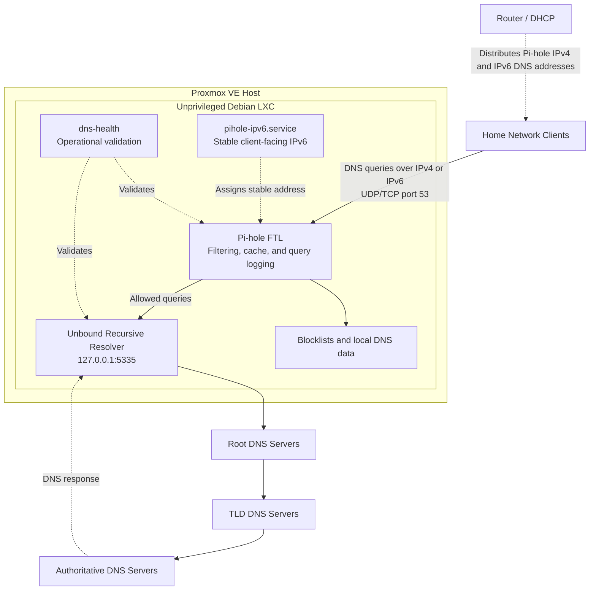

# Pi-hole + Unbound DNS Security Project

A portfolio case study documenting a network-wide DNS filtering and recursive-resolution stack built with **Pi-hole** and **Unbound** inside an unprivileged Debian LXC container on Proxmox VE.

**Deployment status:** Completed and validated on July 13, 2026.

## Table of Contents

- [Project Overview](#project-overview)
- [Key Outcomes](#key-outcomes)
- [Final Architecture](#final-architecture)
- [Core Components](#core-components)
- [Technical Artifacts](#technical-artifacts)
- [DNS Resolution Flow](#dns-resolution-flow)
- [Pi-hole Configuration](#pi-hole-configuration)
- [Unbound Configuration](#unbound-configuration)
- [IPv4 and IPv6 DNS Design](#ipv4-and-ipv6-dns-design)
- [Troubleshooting: DNS Interception](#troubleshooting-dns-interception)
- [Health Check Script](#health-check-script)
- [Validation Summary](#validation-summary)
- [Security and Hardening](#security-and-hardening)
- [Problems Solved](#problems-solved)
- [Skills Demonstrated](#skills-demonstrated)
- [Future Improvements](#future-improvements)
- [Authoritative References](#authoritative-references)
- [License](#license)
- [Sanitization Notice](#sanitization-notice)

---

## Project Overview

The completed deployment provides:

- Network-wide DNS filtering and ad/tracker blocking.
- Local query visibility through Pi-hole.
- Recursive DNS resolution through Unbound instead of a public preset resolver.
- DNSSEC validation for signed domains, including rejection of bogus responses.
- Direct DNS access for both IPv4 and IPv6 clients.
- A stable client-facing IPv6 address restored automatically at boot.
- Repeatable operational validation through a custom `dns-health` command.

A major troubleshooting finding was router-level DNS interception. Direct root-server queries initially returned recursion-available responses, which was inconsistent with direct authoritative root-server behavior. The interfering router security feature was identified and disabled before Unbound was placed into service.

## Key Outcomes

| Area | Outcome |
|---|---|
| Filtering | Pi-hole blocks configured ad and tracker domains for network clients |
| Resolution | Allowed queries are forwarded locally to Unbound for recursive resolution |
| DNSSEC | Bogus signed responses are rejected and valid signed responses are authenticated |
| IPv4 and IPv6 | Clients receive Pi-hole as their DNS server over both protocol families |
| Isolation | The DNS stack remains inside an unprivileged LXC container |
| Reproducibility | Sanitized scripts, configurations, installation notes, and validation methods are published |
| Troubleshooting | Router-level DNS interception was detected through root-server response analysis |

---

## Final Architecture



The router distributes the Pi-hole DNS addresses to clients, but it does not act as the resolver in this design. Clients send DNS queries directly to Pi-hole. Pi-hole answers blocked or cached queries locally and forwards permitted queries to Unbound on loopback.

### Proxmox DNS LXC Overview


The DNS stack runs in a lightweight, unprivileged Debian LXC container with no public DNS exposure.

---

## Core Components

| Component | Role |
|---|---|
| Proxmox VE | Hosts the DNS LXC container |
| Debian LXC | Provides lightweight, unprivileged isolation |
| Pi-hole | Filters DNS queries, maintains blocklists and cache, logs queries, and provides the web dashboard |
| Unbound | Performs recursive DNS resolution and DNSSEC validation |
| Router DHCP/DNS settings | Distributes the Pi-hole IPv4 and IPv6 DNS addresses to clients |
| Windows client | Confirms client-side IPv4 and IPv6 DNS assignment |
| [`dns-health`](scripts/dns-health) | Automates operational and security validation |
| [`pihole-ipv6.service`](configs/systemd/pihole-ipv6.service) | Restores the stable client-facing IPv6 address at boot |

---

## Technical Artifacts

The repository includes sanitized, parameterized versions of the custom files used by the working deployment:

| Artifact | Purpose |
|---|---|
| [`scripts/dns-health`](scripts/dns-health) | Validates services, listeners, resolution, blocking, DNSSEC, root-server access, and forwarding |
| [`scripts/add-pihole-ipv6.sh`](scripts/add-pihole-ipv6.sh) | Adds the configured stable IPv6 address to the Pi-hole interface |
| [`configs/systemd/pihole-ipv6.service`](configs/systemd/pihole-ipv6.service) | Runs the stable-IPv6 helper during system startup |
| [`configs/systemd/pihole-ipv6.default.example`](configs/systemd/pihole-ipv6.default.example) | Supplies public-safe example settings for the IPv6 service |
| [`configs/systemd/dns-health.default.example`](configs/systemd/dns-health.default.example) | Supplies optional settings for the health-check command |
| [`configs/unbound/pi-hole.conf`](configs/unbound/pi-hole.conf) | Contains the sanitized Unbound recursive-resolver configuration |
| [`docs/technical-artifacts.md`](docs/technical-artifacts.md) | Documents installation paths and deployment commands |
| [`VALIDATION.md`](VALIDATION.md) | Records tested versions, commands, expected outcomes, and observed results |

---

## DNS Resolution Flow

```text
Router / DHCP
  → distributes the Pi-hole IPv4 and IPv6 DNS addresses to clients

Client device
  → sends DNS queries directly to Pi-hole on port 53
  → Pi-hole checks its cache, local DNS data, and blocklists
  → blocked queries are answered locally by Pi-hole
  → allowed queries are forwarded to Unbound on 127.0.0.1#5335
  → Unbound performs recursive resolution through the DNS hierarchy
  → Unbound validates signed DNSSEC responses and rejects bogus responses
  → the response returns through Pi-hole to the client
```

Client-facing IPv6 DNS and Unbound's outbound recursion transport are separate. Clients can reach Pi-hole over IPv6 while Pi-hole forwards locally to Unbound over IPv4 loopback.

---

## Pi-hole Configuration

Pi-hole provides the filtering and visibility layer:

- Listens for client DNS queries on port `53`.
- Applies blocklists and local DNS data.
- Maintains DNS cache and query logs.
- Forwards permitted queries only to local Unbound at `127.0.0.1#5335`.
- Does not use a public preset upstream resolver for normal permitted queries.

### Pi-hole Dashboard Overview


### Pi-hole Upstream DNS Configuration


The configured custom upstream is:

```text
127.0.0.1#5335
```

### Blocked Query Evidence


The query log shows `doubleclick.net` blocked by Pi-hole. The **Allow** and **Deny** controls are administrative action buttons; the row's blocked status is the evidence of enforcement.

---

## Unbound Configuration

Unbound provides the recursive-resolution layer:

- Listens only on `127.0.0.1`.
- Uses port `5335` to avoid conflicting with Pi-hole on port `53`.
- Performs outbound recursion over IPv4 in this deployment.
- Supports UDP and TCP DNS queries.
- Enables DNSSEC hardening and validation.
- Is not exposed to network clients; Pi-hole forwards to it locally.

The sanitized configuration is published at [`configs/unbound/pi-hole.conf`](configs/unbound/pi-hole.conf).

### DNSSEC Validation Evidence


The validation covers both required outcomes:

- A deliberately broken signed domain returns `SERVFAIL`.
- A valid signed domain returns `NOERROR` with the authenticated-data (`ad`) flag.

---

## IPv4 and IPv6 DNS Design

- IPv4 clients receive the Pi-hole IPv4 DNS address from the router.
- IPv6 clients receive a stable local IPv6 DNS address for Pi-hole.
- A systemd oneshot service restores that address during boot.
- External or ISP-provided IPv6 DNS resolvers are not configured as client fallbacks.
- Unbound can use IPv4 for outbound recursion while Pi-hole still accepts client DNS queries over IPv6.

### Windows Client DNS Validation


The active Windows interface shows the intended Pi-hole DNS server addresses for both IPv4 and IPv6.

---

## Troubleshooting: DNS Interception

Before Unbound was installed, a direct nonrecursive root-server query returned an unexpected recursion-available (`ra`) flag.

Expected behavior:

```text
flags: qr aa
```

Unexpected behavior:

```text
flags included ra
```

Testing from multiple systems isolated the behavior to a router-level advanced security feature. After disabling that feature:

- The captured root-server query returned the authoritative (`aa`) flag without `ra`.
- The A-root `version.bind` identity query returned `ATLAS`.
- Unbound installation proceeded only after direct root-server access was confirmed.

### Root-Server Test Evidence


---

## Health Check Script

The published [`dns-health`](scripts/dns-health) command checks:

- Required command availability.
- IPv4 and IPv6 interface addressing.
- Presence of the configured stable Pi-hole IPv6 address.
- Pi-hole and Unbound service state.
- DNS listeners on ports `53` and `5335`.
- Normal Pi-hole and Unbound resolution.
- Pi-hole blocking behavior.
- Broken and valid DNSSEC behavior.
- Direct root-server access over UDP and TCP.
- Expected A-root identity response.
- Recent Pi-hole forwarding to Unbound.
- Final pass, warning, and failure counts.

Critical failures produce a nonzero exit code, allowing the command to be used by monitoring or automation tools.

### DNS Health Check Evidence


The screenshot records the original working deployment validation. The published script expands that implementation with explicit result handling and separate UDP and TCP root-server checks.

---

## Validation Summary

| Validation area | Observed result |
|---|---|
| Pi-hole and Unbound services | Passed |
| DNS listeners on ports `53` and `5335` | Passed |
| Normal Pi-hole and Unbound resolution | Passed |
| Test-domain blocking | Passed |
| Pi-hole forwarding to `127.0.0.1#5335` | Passed |
| Broken DNSSEC response rejection | Passed |
| Valid DNSSEC response authentication | Passed |
| Direct root-server access without unexpected recursion | Passed |
| Windows IPv4 and IPv6 DNS assignment | Passed |
| Stable IPv6 boot service | Passed |
| Unprivileged LXC configuration | Verified |

See [`VALIDATION.md`](VALIDATION.md) for tested software versions, commands, expected success conditions, observed results, and evidence mapping.

---

## Security and Hardening

- Kept the DNS stack inside an unprivileged LXC container.
- Avoided public exposure of the DNS service.
- Avoided public DNS fallback servers that could bypass Pi-hole.
- Bound Unbound only to localhost.
- Removed router-level DNS interception before enabling recursion.
- Used Unbound rather than forwarding normal permitted queries to a public preset resolver.
- Enabled DNSSEC validation and tested both valid and bogus signed responses.
- Left system time management with the Proxmox host instead of granting the container clock-setting privileges.

---

## Problems Solved

| Problem | Resolution |
|---|---|
| Root-server queries showed unexpected recursion availability | Disabled the router security feature intercepting DNS and retested direct root access |
| IPv6-capable clients could receive an external DNS resolver | Added and distributed a stable local Pi-hole IPv6 address without an external DNS fallback |
| Pi-hole reported an NTP permission warning in the unprivileged LXC | Disabled Pi-hole's internal NTP client and relied on Proxmox host time synchronization |
| Manual validation required many separate commands | Consolidated checks into the reusable `dns-health` command |
| Portfolio documentation lacked reproducible source files | Published sanitized scripts, configurations, installation notes, and validation procedures |

---

## Skills Demonstrated

- Proxmox VE and unprivileged LXC administration.
- Debian server administration.
- Pi-hole filtering and query analysis.
- Unbound recursive DNS configuration.
- DNSSEC validation and failure analysis.
- IPv4 and IPv6 DNS client configuration.
- Router DHCP/DNS and interception troubleshooting.
- Linux systemd service development.
- Bash health-check scripting and exit-code handling.
- Network troubleshooting with `dig`, `ss`, PowerShell, and Pi-hole logs.
- Security-focused documentation and evidence sanitization.

---

## Future Improvements

- Add a second Pi-hole instance for DNS redundancy.
- Add automated service-failure alerts.
- Add long-term metrics collection and dashboards.
- Document restoration from Proxmox backups.
- Forward selected DNS telemetry into the SOC lab for detection practice.
- Document allowlist and blocklist tuning examples.

---

## Authoritative References

- [Pi-hole: Unbound recursive DNS guide](https://docs.pi-hole.net/guides/dns/unbound/) — local resolver configuration, DNSSEC validation, root-server reachability tests, and Pi-hole upstream configuration.
- [NLnet Labs: `unbound.conf` reference](https://unbound.docs.nlnetlabs.nl/en/latest/manpages/unbound.conf.html) — authoritative reference for Unbound server options.
- [Proxmox VE: Linux Container documentation](https://pve.proxmox.com/pve-docs/chapter-pct.html) — container architecture, configuration, and management.
- [systemd: `systemd.service` documentation](https://www.freedesktop.org/software/systemd/man/latest/systemd.service.html) — service-unit behavior used by the stable-IPv6 helper.
- [Microsoft: `Get-DnsClientServerAddress`](https://learn.microsoft.com/en-us/powershell/module/dnsclient/get-dnsclientserveraddress) — Windows client DNS-server validation.

---

## License

This project is licensed under the [MIT License](LICENSE).

---

## Sanitization Notice

This public portfolio version intentionally removes or generalizes:

- Live internal IPv4 addresses.
- Live public and local IPv6 addresses or prefixes.
- Client names and device names.
- Live system usernames and identifying hostnames.
- Host-specific identifiers.
- Browser or session details.
- Unrelated or sensitive query-log entries.
- Router-specific private configuration details.

Documentation-only address ranges and fictional example values may appear where needed to demonstrate configuration structure without exposing the live home network.
